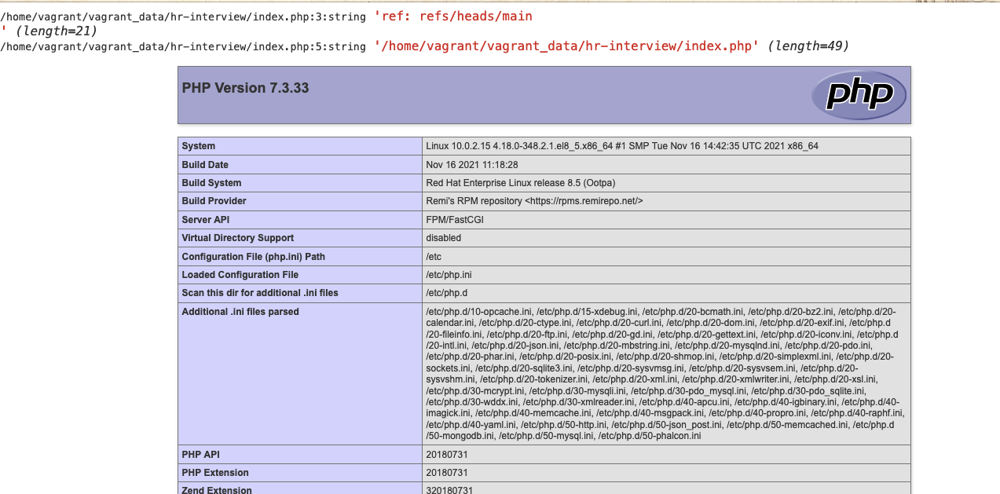

### 1.为何选择远程工作？

> 1.为了拓宽职业生涯，在技术道路上一直走下去
>
> 2.为了缩短通勤时间，把时间花在有意义的事情上
>
> 3.另外也是因为疫情原因，减少人员接触


### 2.未来2年有打算常住哪个城市？

>济南         

### 3.如果将来的5年都在我们公司工作，对职位，收入，工作内容有什么期待？

>职位方面： 希望稳步提升，本人不善言辞 ，喜欢技术，希望一直做技术下去
>
>收入: 希望随着公司的发展薪资稳步提高
>
>工作内容： 做技术相关工作，不限于前后端，有机会的话也可以研究学习客户端，了解公司业务，根据业务优化代码 ,不断提升用户体验

### 4.团队会议时间外，平时的工作日打算怎么安排时间？

> 首先要确保工作进度按时完成，如果有空闲时间的话优化代码或者学习公司所用的其他技术栈

### 5.有什么想问的问题？

>1.想了解一下技术人员分布
>
>2.入职后我主要负责那些方面

### 6.搭建开发环境 Linux + NGINX + PHP

> 使用vagrant 搭建的 virtual box + centos 8 lnmp环境

​	





[6.2文件](https://drive.google.com/file/d/1GeW15g-aKgDWwMJhGcrYjGFlUQHddfLK/view?usp=sharing)


### 7.PHP，mySQL

#### 7.1导入数据到 Mysql 并转换数据后导出

> 7.1.1 怎样用PHP长时间运行后台程序？
>
> set_time_limit(0);
>
> 7.1.2 处理大量数据记录时防止内存溢出?
>
> ​	1.增加临时内存
>
> ​	ini_set('memory_limit', '400M');
>
> 读取 sample.json 就是用的这个方式，因为整个json文件都在一行，无法使用fopen按行   yield fgets 读取文件，所以选择了加大临时内存配合file_get_contents读取的文件
>
> ​    2.yield异步处理(尤其对二进制文件 yield 分割读取)
>
> ​    3. 使用strem读取文件 stream_get_contents
>
> 导出是使用的yield 异步导出
> 代码用laravel写的
>
> ```
> Route::get('/toDb', 'JsonDataController@batchImport');
> Route::get('/toExportJson', 'JsonDataController@exportJson');
> ```
>
> [7.1导出的文件](https://drive.google.com/file/d/1MB-aD7US6W8SzosPHRZQmE3A9gn9rCsN/view?usp=sharing)

#### 7.2在刚才创建的数据库上，写一条mySQL查询语句

> ```mysql
> select id,string,string_json,JSON_LENGTH(string_json) as total from json_data where string_json->'$[2]' ='directional' having total >= 3;
> ```

### 8.写两条 ElasticSearch 查询语句

#### 8.1  请查询 `(status.live === 1 && type_own_srch === 'D.') || ( status.sold === 1 && type_own_srch === 'V.')`  的其中 100 条结果

> ```json
> {
>     "query": {
>       "bool": {
>          "should": [
>             {
>                "bool": {
>                   "must": [
>                      {"term": {"status.live": 1}},
>                      {"term": {"type_own_srch": "D."}}
>                   ]
>                }
>             },
>             {
>                "bool": {
>                   "must": [
>                      {"term": {"status.sold": 1}},
>                      {"term": {"type_own_srch": "V."}}
>                   ]
>                }
>             }
>          ]
>       }
>    },
>     "size": 100
> }
> ```

#### 8.2 请查询在限定的 Bounding Box 范围内（`-80.112304,43.239200,-78.134765,43.903829`）, `date_search` 距离当前时间小于三个月的所有结果

>
>
>```json
>{
>    "query": {
>      "bool": {
>        "must": [
>            {
>                    "range": {
>                    "date_search": {
>                            "gte": "now-3M",
>                            "lte": "now",
>                            "relation": "within"
>                            }
>                        }
>            },
>            {
>                "geo_bounding_box": {
>                    "geo": {
>                        "bottom_right": {
>                            "lat": 43.239200,
>                            "lon": -80.112304
>                        },
>                            "top_left": {
>                            "lat": 43.903829,
>                            "lon": -78.134765 
>                        }
>                    }
>                }
>            }
>        ]
>      }
>   }
>}
>```

### 9.使用 Mongodb 验证某个点是否在多边形中

> ```sql
> db.dddddd.find({"features.geometry":{
>       $geoIntersects: {
>          $geometry: {
>             type: "Point",
>             coordinates: [-52.7570942,47.5408525]
>          }
>       }
> }})
> ```
>
> 坐标(-52.7570942,47.5408525)  不在此多边形中
>
> ```sql
> db.dddddd.find({"features.geometry":{
>       $geoIntersects: {
>          $geometry: {
>             type: "Point",
>             coordinates: [-52.753193,47.5423525]
>          }
>       }
> }})
> ```
>
> 坐标(-52.753193,47.5423525)在此多边形中

10.PHP 性能调试

>    可能瞬间涌入大量用户，导致请求过多，php-fpm反应不过来，导致堵塞
>
> ​	可能存在慢查询问题，接口瞬间堵塞，找到对应慢查询，修改代码或者sql
>
>   可以使用xhprof的扩展tideways来分析(xhprof对php已停止维护,社区在xhprof的基础上开发的支持php7的性能分析优化扩展)

11.分享一个你难忘的开发经历，可以是修复某一个BUG、开发一个功能、一场技术分享或者其它你觉得可以说道的事情。

>在这次做面试题的过程中就遇到个问题(vagrant 默认磁盘10g)，装完lnmp环境能正常跑，随着装的东西越来越多，再装完elatsicsearch、kibana这些后，再装mongo，发现服务起不来了,然后df -h 一看 /dev/sda1空间只剩二百m，nginx等各服务都起不来，网上找到扩容方法试了一遍也没有成功，最后放弃vagrant管理虚拟机，直接用virtual box 重新搭建的lnmp
>
>


# angular部分面试题


### 1.简述Angular组件的⽣命周期

>
>
>| 名称                      | 说明                 |    范围    |
>| :------------------------ | :------------------- | :--------: |
>| `constructor`             | 构造函数             | 指令和组件 |
>| `ngOnChanges()`           | 属性变更通知         | 指令和组件 |
>| `ngOnInit()`              | 组件初始化           | 指令和组件 |
>| `ngDoCheck()`             | 每一次变更检测时     | 指令和组件 |
>| `ngAfterContentInit()`    | 子组件初始化后       |    组件    |
>| `ngAfterContentChecked()` | 子组件变更检测之后   |    组件    |
>| `ngAfterViewInit()`       | 组件初始化后         |    组件    |
>| `ngAfterViewChecked()`    | 组件每次变更检测之后 |    组件    |
>| `ngOnDestroy()`           | 初始销毁之前         | 指令和组件 |
>
>* constructor: 构造函数永远首先被调用
>
>* ngOnChanges: 输入属性变化时被调用
>
>* ngOnlnit: 组件初始化时被调用
>
>* ngDoCheck: 脏值检测时调用
>
>* ngAfterContentInit: 当内容投影ng-content完成时调用
>
>* ngAfterContentChecked: Angular检测投影内容时调用(多次)
>
>* ngAfterViewInit: 当组件视图(子视图)初始化完成
>
>* ngAfterViewChecked: 当检测视图变化时(多次执行)
>
>* ngOnDestroy: 当组件销毁时


### 2.简述Angular⾮⽗⼦组件的通信⽅式

> 我们可以结合Rxjs中的BehaviorSubject对象来创建一个共享服务也就是发布订阅模式,`BehaviorSubject`是`subject`的变体，具有类似的多播功能，不同的是，`BehaviorSubject`需要初始值，并且会在订阅时发出当前值

### 3.rxjs有哪三种observers( 或者有哪三种消息 )

> next, error, complete三种方法

### 4.简述rxjs: switchMap, concatMap, mergeMap区别

>
>
>* mergeMap在处理 inner Observables时是立即执行，也就是说所有的inner Observables在执行下一个inner Observable 时没有等待上一个 inner Observable是否结束，同时也不能取消上一个 inner Observable的执行且inner Observable的执行还是无序的，所有的inner Observables 是直接合并到最终输出的Observable上。
>
>* concatMap
>   concatMap是按输入的顺序执行的，concatMap在处理下一个inner Observable前会等待上一个inner Observable执行的结束，同时concatMap和mergeMap一样不能取消inner Observable的执行。
>
>* switchMap
>   switchMap会优先处理最近的inner Observable，与concatMap和mergeMap不同的是switchMap在执行下一个inner Observable前可以取消上一个inner Observable的执行，在Observable被取消后emit的 inner Observable会被丢弃（不包括最终的Observable）

### 5.用vue.js，angular（或类似框架）开发的SPA，运行时发现浏览器报告内存使用过高。

#### 5.1怎样调试判断是否有内存泄漏？

> 可以借助Chrome浏览器的调试工具里的memory,进行内存分析

#### 5.2 如果是内存泄漏通过哪些手段修复？

> * 规范代码，少使用定时器, 可以使用nextTick的尽量使用nextTick
> * 如果使用定时器的话要记得在页面关闭时清除定时器
> * 尽量少定义全局变量
> * 闭包使用结束后及时清除局部变量

#### 5.3如果不是内存泄漏怎么办？ *结合自己曾经解决的案例说明。

> * 优化代码
>
>   比如上传大文件的时候，可以使用blob，分片上传
>
> * 静态文件放到cdn上
> * 图片放在图床上
>
> * 可能服务器硬件需要升级了

